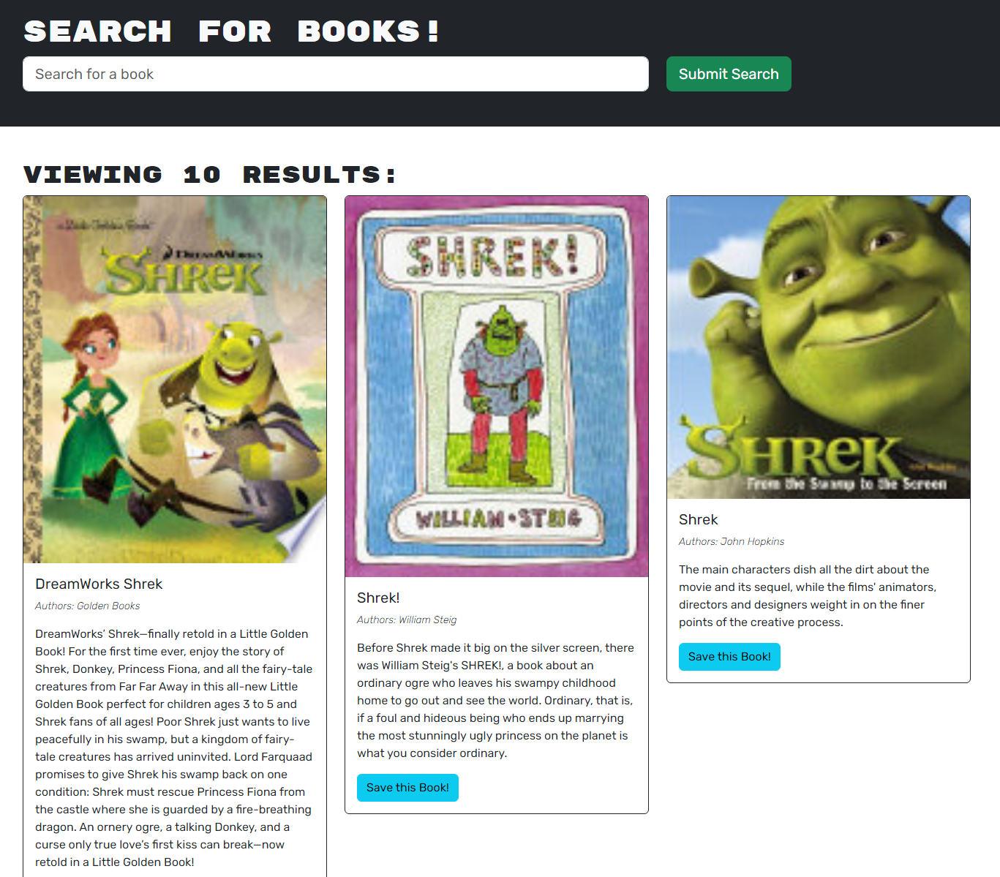

# Library_Search

  

---

## Technology Used 🖥️

| Technology Used         | Resource URL           | 
| ------------- |:-------------:| 
| JavaScript | [https://developer.mozilla.org/en-US/docs/Web/JavaScript](https://developer.mozilla.org/en-US/docs/Web/JavaScript)     |  
| React | [https://react.dev/](https://react.dev/) |     
| Apollo | [https://www.apollographql.com/docs/react/](https://www.apollographql.com/docs/react/) |
| GraphQL | [https://graphql.org/](https://graphql.org/) |
| Mongoose | [https://mongoosejs.com/](https://mongoosejs.com/) |
| MongoDB | [https://www.mongodb.com/](https://www.mongodb.com/) |
| JWT | [https://jwt.io/](https://jwt.io/) |
| HTML | [HTML](https://developer.mozilla.org/en-US/docs/Web/HTML)         |   
| CSS | [CSS](https://developer.mozilla.org/en-US/docs/Web/CSS)         |   
| Heroku | [Heroku](https://devcenter.heroku.com/articles/heroku-cli)     |
| Git | [https://git-scm.com/](https://git-scm.com/)     |  

---

## Description 📝

Library_Search is a simple application that uses the Google Books API to find and save books to your account.

It uses GraphQL alongside MongoDB and Mongoose to save, update, and read information about the user and their associated books.

The front end was made with React.js to handle client-side rendering along with stateful updates without having to refresh the page in its entirety.

-----------------------

## Table of Contents 📋
* [Installation Instructions](#installation-instructions-📥)
* [Usage Information](#usage-information-✅)
* [Contribution Guidelines](#contribution-guidelines-🤝)
* [Test Instructions](#test-instructions-🧪)
* [Author Info](#author-info-👺)
* [Questions?](#questions-❓)
* [License](#license-🚩)

----------------------

## Installation Instructions 📥

install

------------------------

## Usage Information ✅

usage

------------------------

## Contribution Guidelines 🤝

DELETE THIS

----------------------

## Test Instructions 🧪

DELETE THIS

------------------------

## Author Info 👺

### ***daevidvo***
* [Github](https://www.github.com/daevidvo)
* [LinkedIn](https://www.linkedin.com/in/daevidvo)
* [Instagram](https://www.instagram.com/daevidvo)

--------------------------

## Questions ❓

Email me at: [daevidvo@gmail.com](mailto:daevidvo@gmail.com) or [visit my GitHub](https://www.github.com/daevidvo)

------------------------

## License 🚩

https://opensource.org/licenses/MIT

The MIT License (MIT)
=====================

Copyright © daevidvo

Permission is hereby granted, free of charge, to any person
obtaining a copy of this software and associated documentation
files (the “Software”), to deal in the Software without
restriction, including without limitation the rights to use,
copy, modify, merge, publish, distribute, sublicense, and/or sell
copies of the Software, and to permit persons to whom the
Software is furnished to do so, subject to the following
conditions:

The above copyright notice and this permission notice shall be
included in all copies or substantial portions of the Software.

THE SOFTWARE IS PROVIDED “AS IS”, WITHOUT WARRANTY OF ANY KIND,
EXPRESS OR IMPLIED, INCLUDING BUT NOT LIMITED TO THE WARRANTIES
OF MERCHANTABILITY, FITNESS FOR A PARTICULAR PURPOSE AND
NONINFRINGEMENT. IN NO EVENT SHALL THE AUTHORS OR COPYRIGHT
HOLDERS BE LIABLE FOR ANY CLAIM, DAMAGES OR OTHER LIABILITY,
WHETHER IN AN ACTION OF CONTRACT, TORT OR OTHERWISE, ARISING
FROM, OUT OF OR IN CONNECTION WITH THE SOFTWARE OR THE USE OR
OTHER DEALINGS IN THE SOFTWARE.
